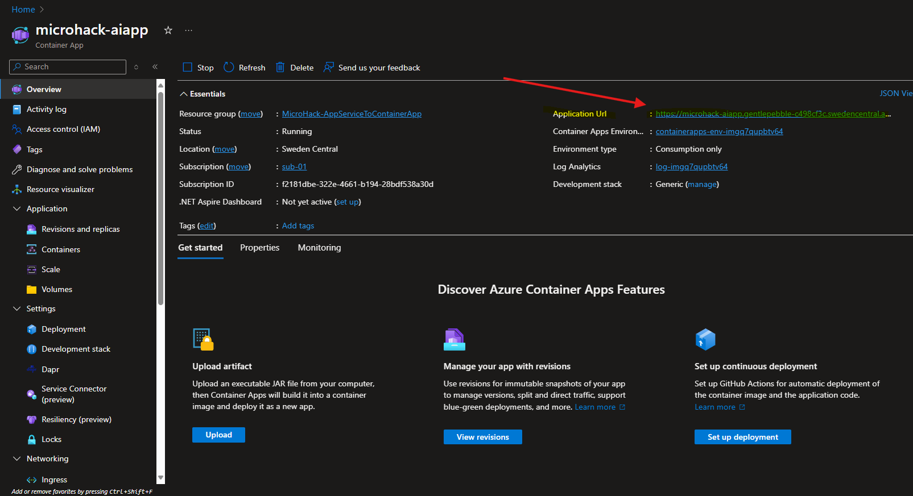
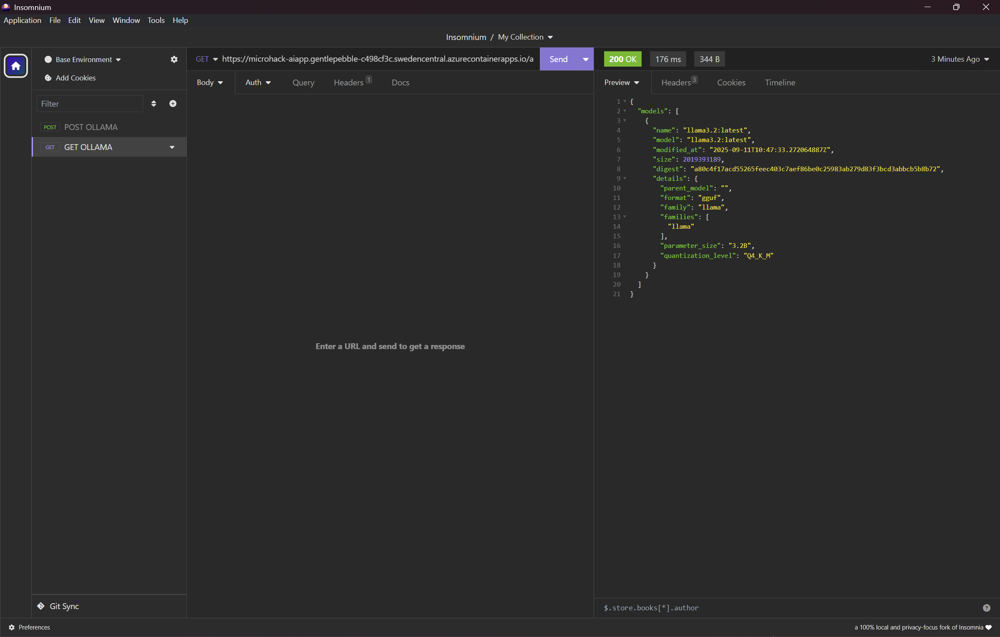
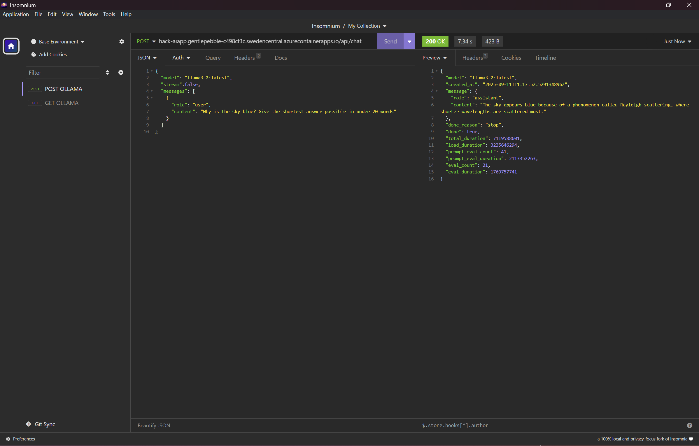
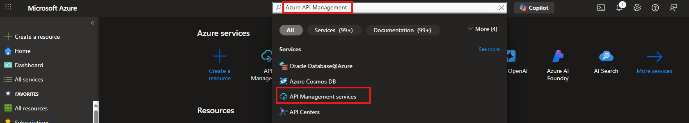
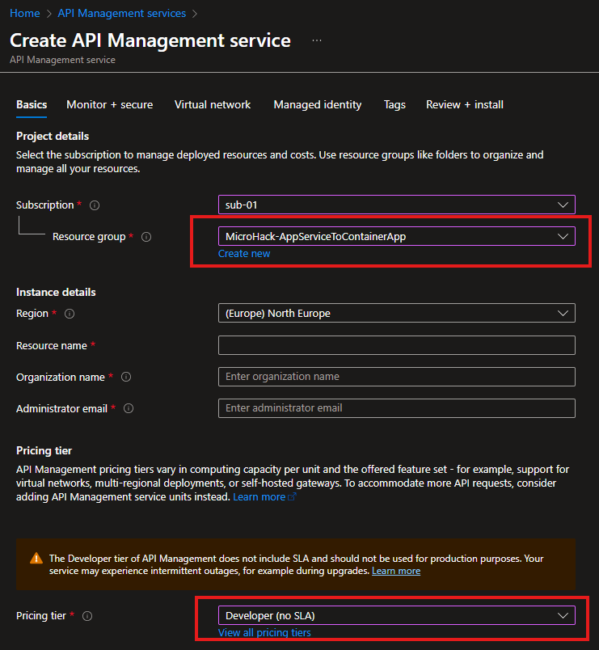
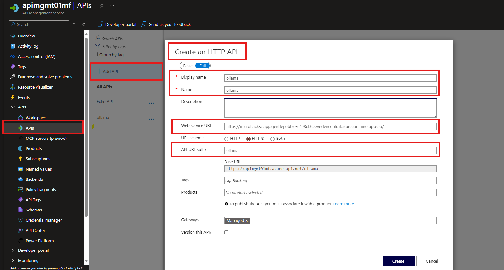
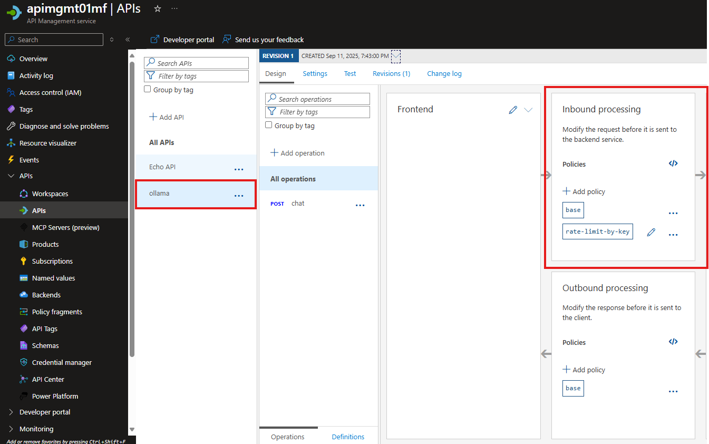
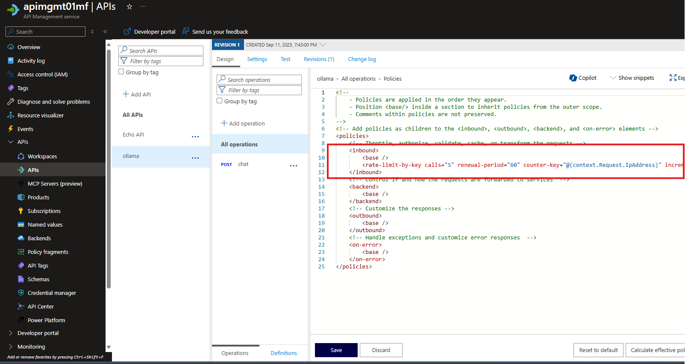
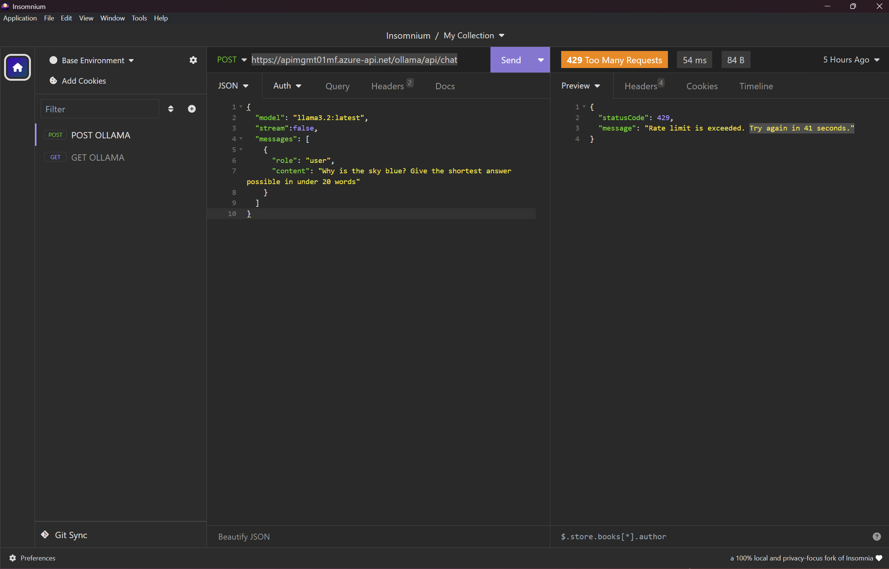

# Walkthrough Challenge 6 - Calling Ollama model with the API

Duration: 60 minutes.
*NOTE: It takes approximately 30 minutes to provision an Azure API Management instance.*

## Prerequisites

Please make sure thet you successfully completed [Challenge 5](../challenge-5/solution.md) before continuing with this challenge.

Please make sure you have one of those tools available: [Postman](https://www.postman.com/downloads/) or [insomnium](https://github.com/ArchGPT/insomnium) or [CURL](https://curl.se/docs/manpage.html) on your machine.

### **Task 1: Change the AI container app so it can accept the traffic from anywhere**

In the Azure Portal look for the Container App which is hosting an Ollama model. We have refered to it as `microhack-aiapp`.

In the *Network* tab of the Container App, you need to look for `Ingress` configuration.

You need to change the *Ingress Traffic* option from *Limited to Container App Enviroment* to *Accepting traffic from anywhere*.


Now the access to Ollama working inside the container can happen from any source.

### **Task 2: Test the Ollama model responses.**

Please open either the browser or one of the mentioned tools to generate a simple GET request to Ollama container.

To do that, you have to know the Ollama container ingress endpoint taken from Azure.

*BEFORE YOU MOVE ON*
You will need a ingress link for the Container App with the Ollama model.
You can find this by openning the *Overview* tab in the Azure Portal for the Container App, the link will be visible under *Application URL*. Have a look on the screen below.


At first, we will get the list of all the models Ollama can offer by calling:
```
https://<microhack-aiapp ingress URL>/api/tags
```
The call may look like this:


The response:
```json
{
	"models": [
		{
			"name": "llama3.2:latest",
			"model": "llama3.2:latest",
			"modified_at": "2025-09-10T10:47:33.272064887Z",
			"size": 2019393189,
			"digest": "a80c4f17acd55265feec403c7aef86be0c25983ab279d83f3bcd3abbcb5b8b72",
			"details": {
				"parent_model": "",
				"format": "gguf",
				"family": "llama",
				"families": [
					"llama"
				],
				"parameter_size": "3.2B",
				"quantization_level": "Q4_K_M"
			}
		}
	]
}
```

### **Task 3: Let's chat with the model through the API.**

So now, let's call the Ollama model to chat with it.

In the tool of your choice (I am using Insomnium in here), create a simple POST request to API endpoint:
```
https://<microhack-aiapp ingress URL>/api/chat
```

JSON request body should look like below:
```json
{
  "model": "llama3.2:latest",
  "stream":false,
  "messages": [
    {
      "role": "user",
      "content": "Why is the sky blue? Give the shortest answer possible in under 20 words"
    }
  ]
}
```

Don't forget about the Headers, you need to add at least *Content-Type* header with *application/json* value.

The call will look like this:


The expected output will look like the one below:
```json
{
	"model": "llama3.2:latest",
	"created_at": "2025-09-10T11:17:52.529134896Z",
	"message": {
		"role": "assistant",
		"content": "The sky appears blue because of a phenomenon called Rayleigh scattering, where shorter wavelengths are scattered most."
	},
	"done_reason": "stop",
	"done": true,
	"total_duration": 7119588601,
	"load_duration": 3235646294,
	"prompt_eval_count": 41,
	"prompt_eval_duration": 2113352263,
	"eval_count": 21,
	"eval_duration": 1769757741
}
```

### **Task 4: Let's chat with the model through the Azure API Management**

What you have done in the past three tasks was a simple but not scalaable at all, especially if you want to expose services at scale. To change that, let's add Azure API Management which will help you to rate limit the calls which are coming.

The challange is the following:
1. Spin up a Developer SKU of Azure API Management. To do this:
	- Go to Search tab at the top of Azure Portal and type: Azure API Management. 
	- Make sure to choose a Developer SKU and pick the same Resource Group, where you have the rest of you infrastructure. 
	- You can use the default settings for the rest of the parameters of Azure API Management.

2. Configure a simple HTTP API to `microhack-aiapp` Container App
Follow the steps below and check the provided images to help you out with the task.
- Open API's tab in Azure API Management Service in Azure Portal
- Then click *Add API* and choose *HTTP API*
- Provide the *Name* and *Display Name*
- Put the *Web service URL* using the ingress link from [ask 1: Change the AI container so it's accept the traffic from anywhere](#task-1-change-the-ai-container-so-its-accept-the-traffic-from-anywhere)
- Choose the API URL Suffix. In this particular task whatever name you pick is fine. If you expose many API's on your APIM, choosing the right one is important. Note down the link. As of now, if you want to call specific API in Ollama you will use Azure API Management Gateway URL + API URL suffix + the API you want to call.
Based on the screenshot we have provided the final link to API will go like this: https://apimgmt01mf.azure-api.net/ollama/api/chat, where *https://apimgmt01mf.azure-api.net* is Azure API Management Gateway URL, *ollama* is API URL suffix and */api/chat* is the API exposed by the Ollama in the container. 


3. Now you need to go to *Inbound processing* view for the API you have defiend to add the policy. To add a policy open the code of inbound processing using the icon "</>".


4. Then, add a policy [Limit call rate by key](https://learn.microsoft.com/en-us/azure/api-management/rate-limit-by-key-policy) policy. You can use for that purpose a sample:
```xml
 <rate-limit-by-key calls="5"
              renewal-period="60"
              increment-condition="@(context.Response.StatusCode == 200)"
              counter-key="@(context.Request.IpAddress)"
              remaining-calls-variable-name="remainingCallsPerIP"/>
```
The final inbound policy may look like this:


5. Then check by using Postman, Curl or other tool we need to test if the limit will be enforced. Make sure you call the API more than the limit you have configured.
Make sure you use the URL to your API Management Gateway. Check step 2 in [Task 4](#task-4-lets-chat-with-the-model-through-the-azure-api-management) if you are not sure. If you will try to call your `microhack-aiapp` app, the limit will not be enforced.


6. To experiment further you could change the code of the frontend app to use API Management Gateway but this is beyond this MicroHack.

You successfully completed challenge 6! 🚀🚀🚀

 **[Home](../../Readme.md)**