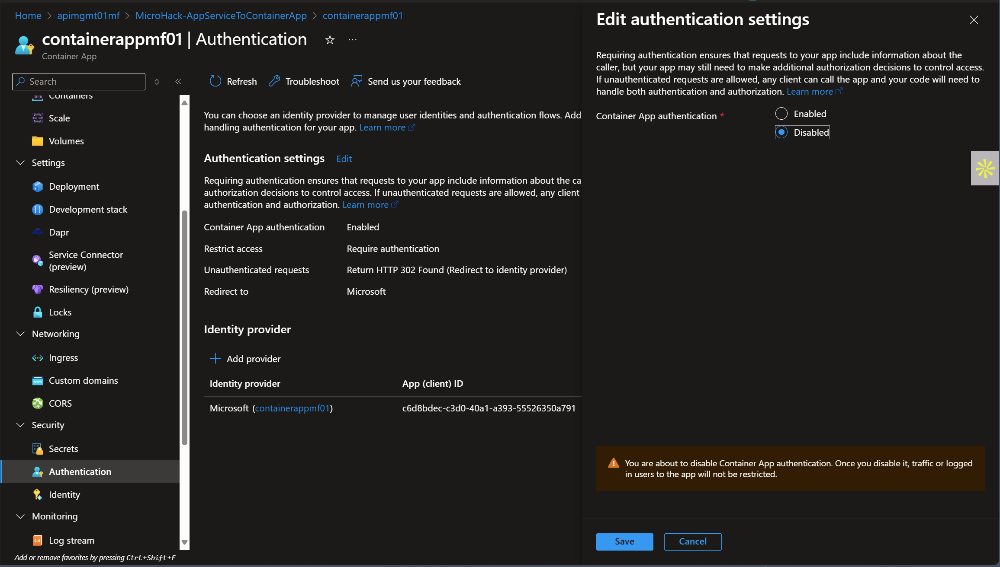
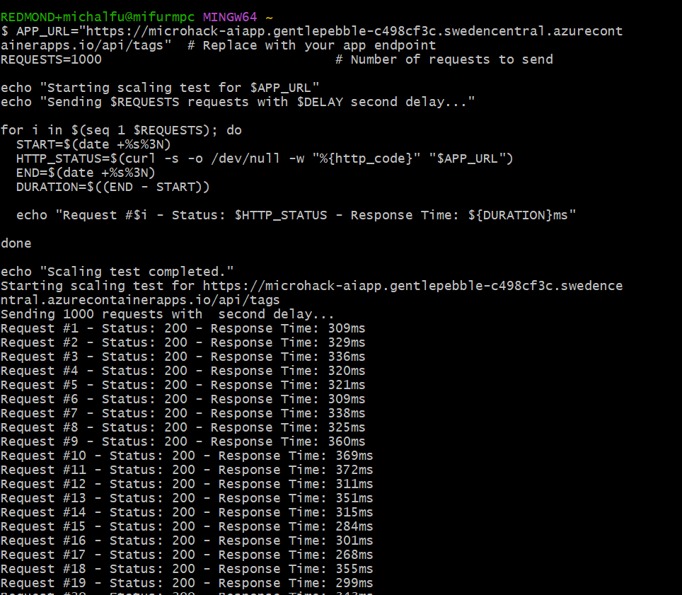
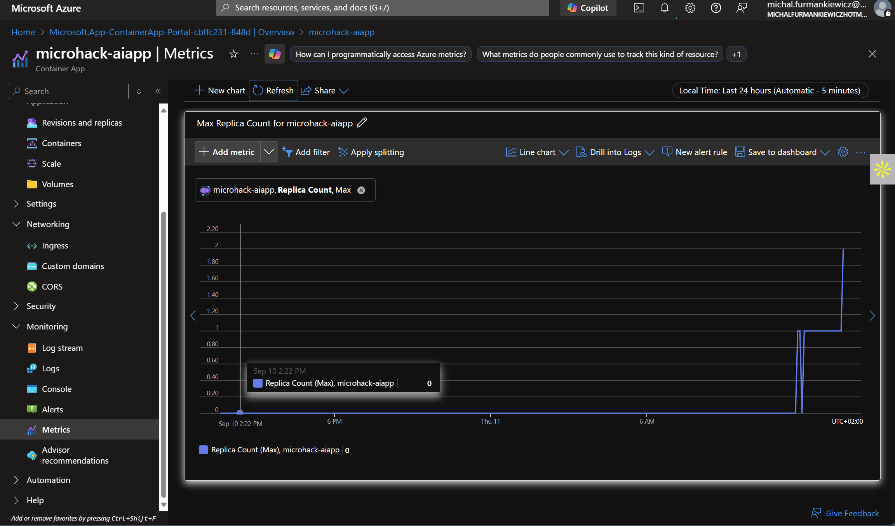

# Walkthrough Challenge 7 - Testing the autoscaling of our app

Duration: 30 minutes

## Prerequisite
Please make sure thet you successfully completed [Challenge 5](../challenge-5/solution.md) before continuing with this challenge.

### **Task 1: Turn off the authentication for tha main Container App**

To do this, open the Container App in Azure Portal.
On the left hand side look for *Security* and then *Authentication*.
Once there, turn off the Authentication as presented on the screen:


### **Task 2: Run the script to generate the traffic**

Open Git Bash or Azure Cloud Bash Shell to generate the traffic.

Use the script below to do that. Make sure you have the right URL to ingress to the Container App.

```bash
echo "Scaling test completed."

# TODO: Replace with your ingress URL
APP_URL="https://microhack-aiapp.gentlepebble-c498cf3c.swedencentral.azurecontainerapps.io/" 

REQUESTS=1000 # Number of requests to send

echo "Starting scaling test for $APP_URL"

for i in $(seq 1 $REQUESTS); do
  START=$(date +%s%3N)
  HTTP_STATUS=$(curl -s -o /dev/null -w "%{http_code}" "$APP_URL")
  END=$(date +%s%3N)
  DURATION=$((END - START))

  echo "Request #$i - Status: $HTTP_STATUS - Response Time: ${DURATION}ms"

done

echo "Scaling test completed."
```

The script execution will work like this:


### **Task 3: Check that the number of containers has scaled**

Please open the respective Container App, look for *Monitoring* on the left panel and then for *Metrics*.

Choose *Replica Count* to see that the number of containers has scaled.



You successfully completed challenge 7! 🚀🚀🚀

 **[Home](../../Readme.md)**